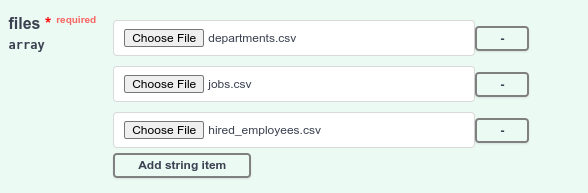
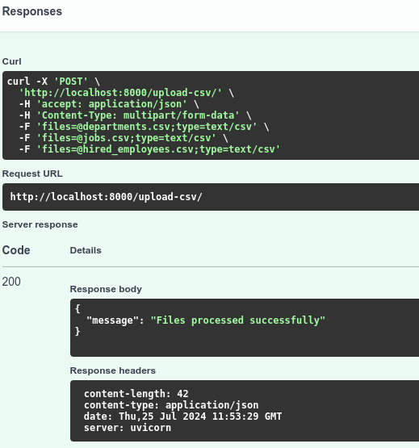
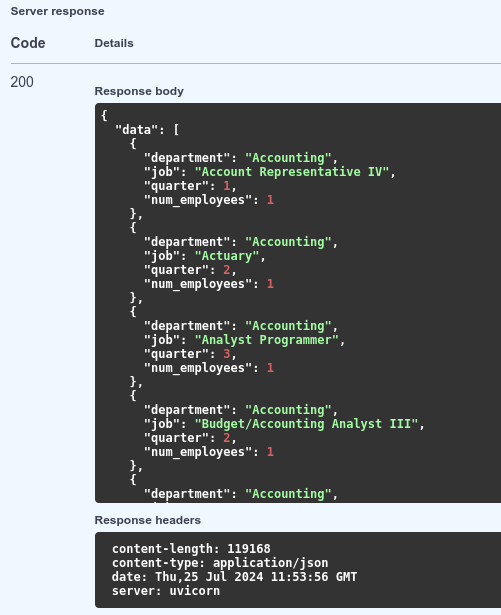
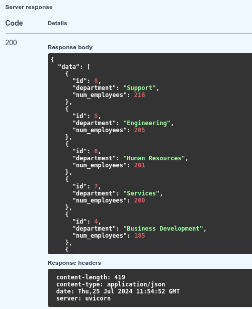
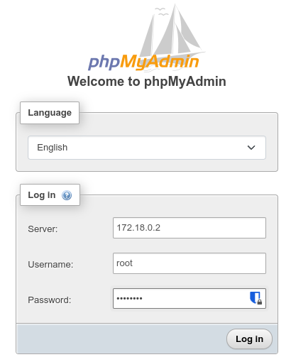
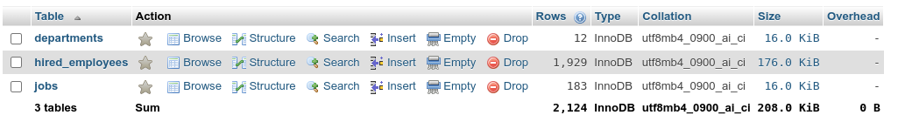
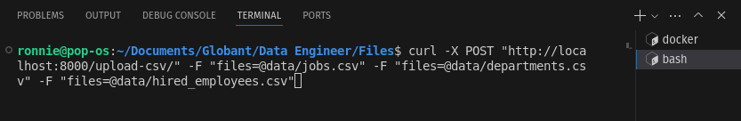
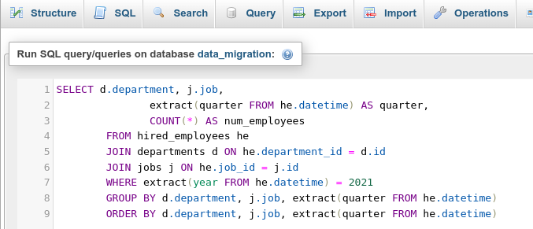
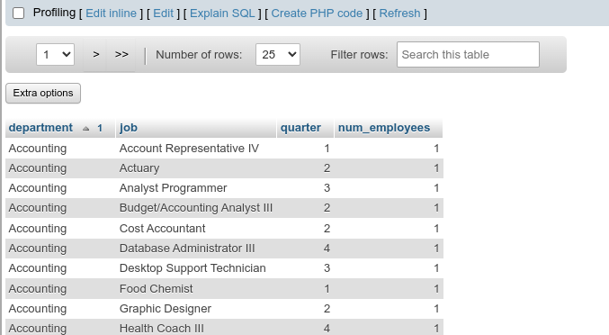

# Data Migration Project

## Overview

This project facilitates the migration of historical data from CSV files into a MySQL database using a FastAPI application. The application dynamically creates tables based on the CSV file names and loads the data into the appropriate tables. This is especially useful for managing job, department, and hired employee data without requiring headers in the CSV files.

The application also includes 2 additional endpoints to query employee data from the MySQL database. These features provide insights into employee hiring statistics for the year 2021, segmented by job and department.

## Features

- Automatic table creation based on file names.
- Data loading into MySQL tables.
- Batch transactions for efficient data insertion.
- Handling of multiple CSV files in a single request.
- Support for job, department, and hired employee data.
- The SQL queries are designed to be executed with the `text()` function from SQLAlchemy to handle raw SQL expressions.

## Table Structures

The tables in the MySQL database are structured as follows:

- **jobs**
  - `id` (int)
  - `job` (string)
  
- **departments**
  - `id` (int)
  - `department` (string)
  
- **hired_employees**
  - `id` (int)
  - `name` (string)
  - `datetime` (string)
  - `department_id` (int)
  - `job_id` (int)

## Prerequisites

- Docker
- Docker Compose
- MySQL

## Getting Started

1. Clone the repository:

```bash
git clone <https://github.com/ronniefuertes/big-data-migration_glbnt>
cd <big-data-migration_glbnt>
```

2. Build and start the Docker containers:

```bash
docker compose up --build
```

3. The FastAPI application will be available at http://localhost:8000/docs

4. To visually see the database go to phpMyAdmin at http://localhost:8080

## Data Rules
### CSV File Naming Convention
The application determines the table name based on the CSV file names. The CSV files should follow these naming conventions:

- Files containing the word "job" will be loaded into the jobs table.
- Files containing the word "department" will be loaded into the departments table.
- Files containing the word "hired_employee" will be loaded into the hired_employees table.

### No Headers in CSV Files
Ensure that the CSV files do not have headers. The application assigns columns to the tables based on the file type:

- `jobs`: 2 columns (id, job)
- `departments`: 2 columns (id, department)
- `hired_employees`: 5 column (id, name, datetime, department_id, job_id)

### Data dictionary rules
the system will not only check for duplicates within the CSV file but also ensure that no duplicate records are inserted into the database.

- **Session Management**: Introduced SessionLocal for managing database sessions.
- **Data Insertion with Duplication Check**: Added insert_data_with_check function to check for existing records in the database before inserting new ones. This function uses SQLAlchemy ORM to query the database and avoid inserting duplicates.
- **Unique Constraints**: Ensure that the table schema includes primary keys or unique constraints where necessary.

## Project Structure
- **app/main.py**: The main FastAPI application file.
- **Dockerfile**: Dockerfile for building the FastAPI application.
- **docker-compose.yml**: Docker Compose file for setting up the FastAPI application and MySQL database.
- **data/**: Directory to store the uploaded CSV files.
- **documentation/**: Directory to store the file with the challenge.
- **images**: Directory to store images of the project.

## Usage
### Using "localhost:8000/docs"

#### Upload CSV Files
You can upload multiple files, as mentioned before the api handles duplicates.



Result



#### Query 1
Number of employees hired for each job and department in 2021 divided by quarter. The result must be ordered alphabetically by department and job.



#### Query 2
List of ids, name and number of employees hired of each department that hired more employees than the mean of employees hired in 2021 for all the departments, ordered by the number of employees hired (descending).



### Using "localhost:8080"
#### Log in into phpMyAdmin
1. Check ipAdress on bash terminal with: 
```bash
# To verify its running and the name (in case it was changed on docker-compose.yml)
docker container ls 
docker inspect docker_mysql # Find the ip at the end
```
2. Use the following information: server: ip, user: root, pass: password



#### Tables of database



#### Upload CSV Files
You can upload multiple files, as mentioned before the api handles duplicates.

```bash
curl -X POST "http://localhost:8000/upload-csv/" -F "files=@data/jobs.csv" -F "files=@data/departments.csv" -F "files=@data/hired_employees.csv"
```



#### Queries
On SQL tab, insert query.






## More Information

For more details about the challenge, please refer to the [documentation](documentation/).

## License
This project is licensed under the MIT License.

