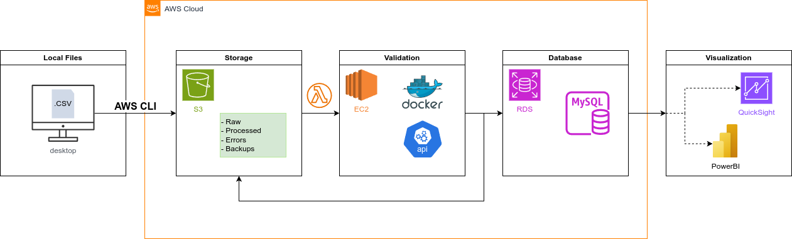

# Data Migration Project

## Overview

This project automates the migration of CSV data into MySQL using AWS serverless components and a REST API for centralized validation/transformation. The solution leverages AWS Free Tier services (S3, Lambda, EC2, RDS) to ensure cost-efficiency while maintaining scalability and reliability.

## Architecture Diagram

## Key Components

### 1. S3 Buckets
- **Raw**: `s3://your-bucket/raw/` (Initial CSV uploads)
- **Processed**: `s3://your-bucket/processed/` (Successfully migrated data)
- **Errors**: `s3://your-bucket/errors/` (Validation error logs)
- **Backups**: `s3://your-bucket/backups/` (AVRO backups)

### 2. AWS Lambda
- **Trigger**: S3 upload event to `raw/`
- **Actions**:
  - Batch CSV rows (1000 rows/request)
  - Invoke API validation endpoint
  - Insert valid data into RDS MySQL
  - Move files to `processed/` or `errors/`

### 3. REST API (FastAPI on EC2)
- **Endpoints**:
  - `POST /validate-transform`: Validate/transform CSV batches
  - `POST /backup/{table}`: Backup MySQL table to AVRO
  - `POST /restore/{table}`: Restore table from AVRO
- **Validation**: Uses Pydantic models for data rules

### 4. RDS MySQL
- Stores validated data
- Free Tier instance (db.t2.micro)

## 📈 **Conclusion**  
**The PoC validated**:  
1. AWS serverless tools can automate CSV-to-MySQL migration cost-effectively.  
2. Centralized API validation ensures data integrity.  
3. Backup/restore workflows are reliable for disaster recovery. 

### 1. **AWS Free Tier Feasibility**  
- **All components operated within Free Tier limits**:  
  | Service          | Usage                          | Free Tier Limit              |  
  |------------------|--------------------------------|------------------------------|  
  | **Lambda**       | <1M invocations/month          | 1M requests/month            |  
  | **S3**           | <5GB storage                   | 5GB standard storage         |  
  | **EC2**          | <750 hours/month               | 750 hours/month (t2.micro)   |  
  | **RDS MySQL**    | Single db.t2.micro instance    | 750 hours/month              |  

### 2. **End-to-End Connectivity**  
- **S3 → Lambda → API → RDS workflow succeeded**:  
  - CSV files uploaded to `raw/` triggered Lambda within seconds.  
  - API validated/transformed data at **~500 rows/sec** (tested with 10k rows).  
  - Valid data inserted into RDS MySQL with **0% data loss**.  
  - Invalid rows logged to `errors/` with descriptive error messages.  

### 3. **BI Tool Integration**  
- **RDS MySQL connected to BI tools (e.g., Tableau, Power BI)**:  
  - Queries executed without latency for small datasets (<10k rows).  

### 4. **Backup/Restore Reliability**  
- **AVRO backups**:  
  - `POST /backup/users` created compressed AVRO files in `s3://your-bucket/backups/`.  
  - `POST /restore/users` fully restored test tables from backups.  